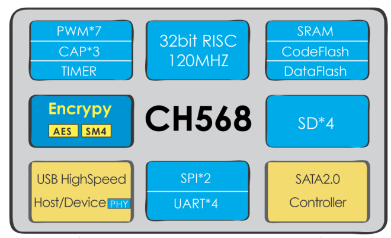

# [CH568](https://github.com/sochub/CH568) 

 

#### [Vendor](https://github.com/sochub/Vendor)：[WCH](https://github.com/sochub/WCH)
#### [Cortex](https://github.com/sochub/Cortex)：[ARM9](https://github.com/sochub/ARM)
#### [Level](https://github.com/sochub/Level)：96/120MHz 

### [CH568简介](https://github.com/sochub/CH568/wiki)

[CH568](https://github.com/sochub/CH568) 是一款高性能32位精简指令集微控制器，系统主频可达120MHZ。片上集成高速USB控制器、SATA2.0控制器以及多组SDIO控制器接口等外设资源，并提供SM4和AES两种加解密算法，支持8种加解密模式。可广泛应用高速传输、信息安全领域。

* 192KB CodeFlash、32KB SRAM、32KB DATA Flash。

* SATA主机/设备控制器, 4组SDIO接口。

* 支持SM4/AES加密算法，8种加密模式。

封装：LQFP48

### [收录资源](https://github.com/sochub/CH568)

* [参考文档](docs/)
* [参考资源](src/)

### [关联资源](https://github.com/sochub)

* [arm-none-eabi编译器](https://github.com/sochub/arm-none-eabi)

### [选型建议](https://github.com/sochub)

[CH568](https://github.com/sochub/CH568) 集成加密算法和大量存储接口，可以应用于大容量存储的MCU场合

##  [SoC资源平台](http://www.qitas.cn)
