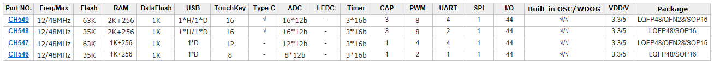

# [CH54](https://github.com/sochub/CH54)

 
####  qitas@qitas.cn
#### 父级：[WCH](https://github.com/sochub/WCH) 
#### 近似：[CH55](https://github.com/sochub/CH55)
#### 归属：[MCS-51](https://github.com/sochub/MCS-51)

## [描述](https://github.com/sochub/CH54/wiki) 

江苏沁恒增强型8051内核单片机，在USB功能的基础上添加更丰富的接口和封装，包括更高精度的ADC和更多的触控按键支持。

 

### [包括型号](https://github.com/sochub/CH54)

- [CH546](https://github.com/sochub/CH546) 
- [CH547](https://github.com/sochub/CH547) 
- [CH548](https://github.com/sochub/CH548) 
- [CH549](https://github.com/sochub/CH549) 

##  [SoC开发平台](http://www.qitas.cn)  

